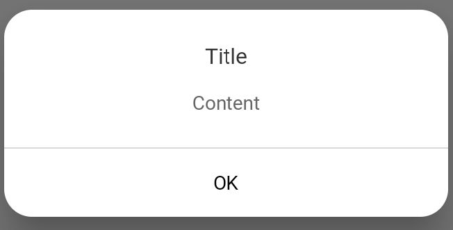
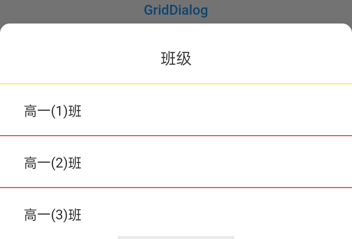
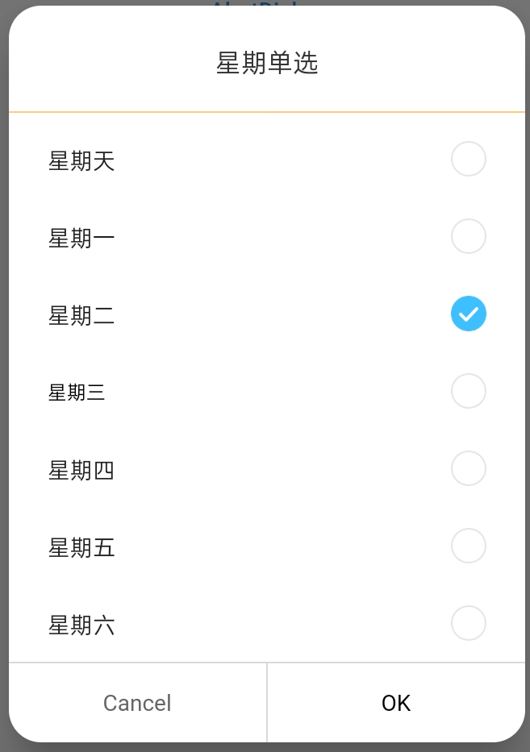
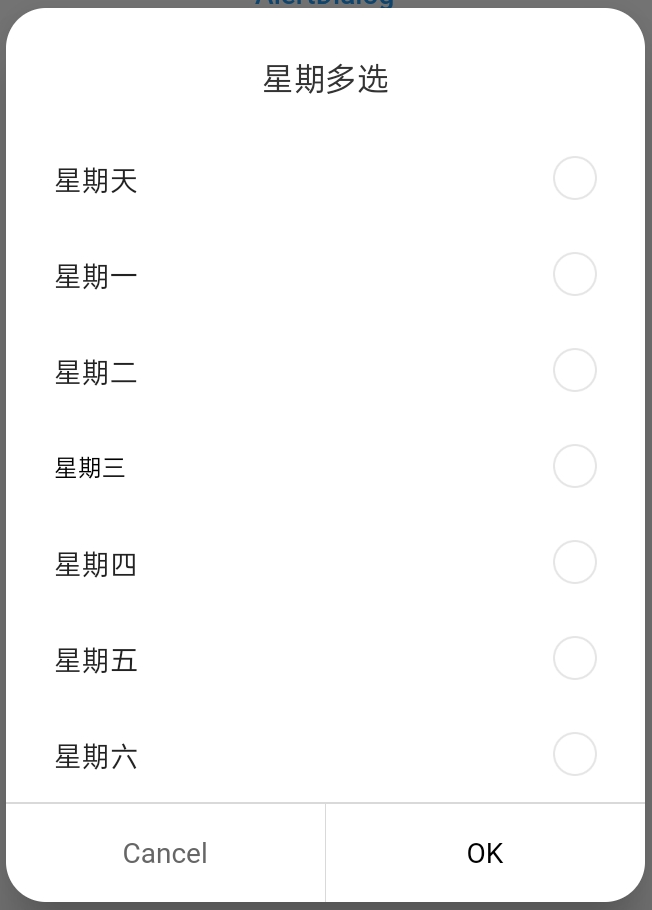
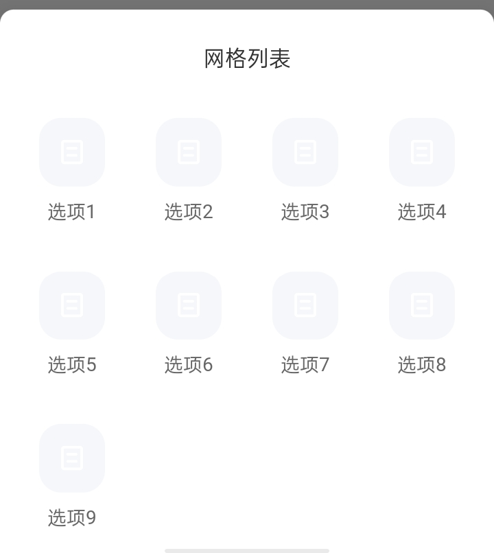
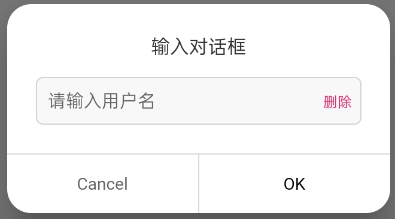

# dh_dialog

`dh_dialog` supports `AlertDialog`, `ListDialog`, `ChoiceDialog`, `GridDialog`, `InputDialog`. If the above cannot meet your needs, you can try to customize `DHDialog`.

##### show dialog

```
Future<T?> showDHDialog<T>({
   required BuildContext context,
   required WidgetBuilder builder,
   RouteTransitionsBuilder? transitionBuilder,
   EntryAnimation entryAnimation = EntryAnimation.none,
   Duration? transitionDuration,
   Color barrierColor = Colors.black54,
   bool barrierDismissible = true,
   bool useSafeArea = true,
   bool useRootNavigator = true,
})
```

You can set the `entryAnimation` parameter to control the entry animation, sliding and fading animations are already supported.

##### dismiss dialog

```
dismissDHDialog(context)
```


##### AlertDialog

```
DHAlertDialog(
  titleText: "Title",
  contentText: "Content",
  hasPositive: true,
  hasNegative: false,
  positiveTap: () => dismissDHDialog(context),
)
```




##### List Dialog

```
DHListDialog(
    titleText: "班级",
    titleAlign: TextAlign.center,
    hasTitleDivider: true,
    datas: [
      DialogListItem(TextItem(text: "高一(1)班"), data: "1"),
      DialogListItem(TextItem(text: "高一(2)班"), data: "2"),
      DialogListItem(TextItem(text: "高一(3)班"), data: "3"),
    ],
    itemAlignment: Alignment.centerLeft,
    itemClickListener: (data, position, context) {
      print('data: $data, position: $position');
      dismissDHDialog(context);
    },
    dividerColor: Colors.yellow,
    itemDividerBuilder: (context, index) => Container(
      color: Colors.red,
      height: 1.0,
    ),
    hasNegative: false,
    hasPositive: false,
    actionDividerBuilder: (context, type) {
      return Container(
        color: Colors.purple,
        height:
            type == DividerType.horizontal ? 1.0 : null,
        width: type == DividerType.vertical ? 1.0 : null,
      );
    },
    contentPadding: EdgeInsets.only(
        bottom: MediaQuery.of(context).padding.bottom),
    dialogMargin: EdgeInsets.zero,
    bottomRadius: 0,
    topRadius: 10,
  );
});
```




##### Option Dialog

```
List<DialogListItem<ChoiceItem, String>> weeks = [
      DialogListItem(
          ChoiceItem(
              imgWidth: 22,
              imgHeight: 22,
              text: Selector.all("星期天"),
              image: Selector.normal(
                  normal: '$imagePathPrefix/check_nor.png',
                  active: '$imagePathPrefix/check_sel.png'),
              selected: false),
          data: "0"),
      DialogListItem(
          ChoiceItem(
              imgWidth: 22,
              imgHeight: 22,
              text: Selector.all("星期一"),
              image: Selector.normal(
                  normal: '$imagePathPrefix/check_nor.png',
                  active: '$imagePathPrefix/check_sel.png'),
              selected: false),
          data: "1"),
      DialogListItem(
          ChoiceItem(
              imgWidth: 22,
              imgHeight: 22,
              text: Selector.all("星期二"),
              image: Selector.normal(
                  normal: '$imagePathPrefix/check_nor.png',
                  active: '$imagePathPrefix/check_sel.png'),
              selected: false),
          data: "2"),
      DialogListItem(
          ChoiceItem(
              imgWidth: 22,
              imgHeight: 22,
              text: Selector.all("星期三"),
              textStyle: Selector.normal(
                  normal: TextStyle(color: Colors.black, fontSize: 12),
                  active: TextStyle(color: Colors.red, fontSize: 14)),
              image: Selector.normal(
                  normal: '$imagePathPrefix/check_nor.png',
                  active: '$imagePathPrefix/check_sel.png'),
              selected: false),
          data: "3"),
      DialogListItem(
          ChoiceItem(
              imgWidth: 22,
              imgHeight: 22,
              text: Selector.all("星期四"),
              image: Selector.normal(
                  normal: '$imagePathPrefix/check_nor.png',
                  active: '$imagePathPrefix/check_sel.png'),
              selected: false),
          data: "4"),
      DialogListItem(
          ChoiceItem(
              imgWidth: 22,
              imgHeight: 22,
              text: Selector.all("星期五"),
              image: Selector.normal(
                  normal: '$imagePathPrefix/check_nor.png',
                  active: '$imagePathPrefix/check_sel.png'),
              selected: false),
          data: "5"),
      DialogListItem(
          ChoiceItem(
              imgWidth: 22,
              imgHeight: 22,
              text: Selector.all("星期六"),
              image: Selector.normal(
                  normal: '$imagePathPrefix/check_nor.png',
                  active: '$imagePathPrefix/check_sel.png'),
              selected: false),
          data: "6"),
    ];

DHChoiceDialog<ChoiceItem, String>(
  titleText: "星期单选",
  itemAlignment: Alignment.centerLeft,
  datas: weeks,
  multiChose: false,
  titleDivider: Divider(height: 10, color: Colors.orange),
);
```




Set the parameter `multiChose` to select multiple.




##### Grid Dialog

```
var datas = [
  TextItem(text: '选项1'),
  TextItem(text: '选项2'),
  TextItem(text: '选项3'),
  TextItem(text: '选项4'),
  TextItem(text: '选项5'),
  TextItem(text: '选项6'),
  TextItem(text: '选项7'),
  TextItem(text: '选项8'),
  TextItem(text: '选项9'),
].mapIndexed((index, e) => DialogListItem(e, data: index))
 .toList();
 DHGridDialog(
     bottomRadius: .0,
     topRadius: 10.0,
     hasNegative: false,
     hasPositive: false,
     dialogAlignment: Alignment.bottomCenter,
     dialogMargin: EdgeInsets.zero,
     titleText: '网格列表',
     itemClickListener:(int? data, int position, BuildContext context) {
                          print('click item $position');
                        },
      datas: datas,
      itemBuilder: (
         BuildContext context,
         TextItem data,
         int index, {
         BorderRadius? borderRadius,
         EdgeInsetsGeometry? padding,
         double? height,
         AlignmentGeometry? alignment,
         GestureTapCallback? onTap,
         }) {
            return GestureDetector(
                     onTap: onTap,
                     behavior: HitTestBehavior.opaque,
                     child: Column(
                     mainAxisAlignment: MainAxisAlignment.center,
                              children: [
                                Container(
                                  padding: EdgeInsets.all(14.0),
                                  decoration: ShapeDecoration(
                                    color: Color(0xFFF5F7FA),
                                    shape: RoundedRectangleBorder(
                                      borderRadius: BorderRadius.all(
                                          Radius.circular(16.0)),
                                    ),
                                  ),
                                  child: Image.asset(
                                    '$imagePathPrefix/default_icon.png',
                                    width: 20,
                                    height: 22,
                                  ),
                                ),
                                SizedBox(height: 8.0),
                                Text(data.text, style: data.textStyle),
                              ],
                            ),
                          );
                        },
                        crossAxisCount: 4,
                        childAspectRatio: 0.76,
                        contentPadding: EdgeInsets.only(
                            left: 10.0,
                            right: 10.0,
                            bottom: MediaQuery.of(context).padding.bottom),
                      );
```




##### Input Dialog

```
showDHDialog(
    entryAnimation: EntryAnimation.slideBottom,
    context: context,
    builder: (context) {
      TextEditingController? editController;
      var getter = (controller) => editController = controller;

      return DHInputDialog(
        titleText: "输入对话框",
        filled: true,
        style: TextStyle(color: Colors.black, fontSize: 15),
        borderStyle: InputBorderStyle.outline,
        controllerGetter: getter,
        keyboardType: TextInputType.number,
        hintText: "请输入用户名",
        suffixOnTap: () => editController?.text = "",
        suffix: Text(
          "删除",
          style: TextStyle(color: Colors.pink, fontSize: 12),
        ),
        positiveTap: (result) {
          dismissDHDialog(context);
        },
        negativeTap: (result) {
          dismissDHDialog(context);
        },
      );
    });
```




The project will continue to improve, if you have any good suggestions, welcome to open the issue

